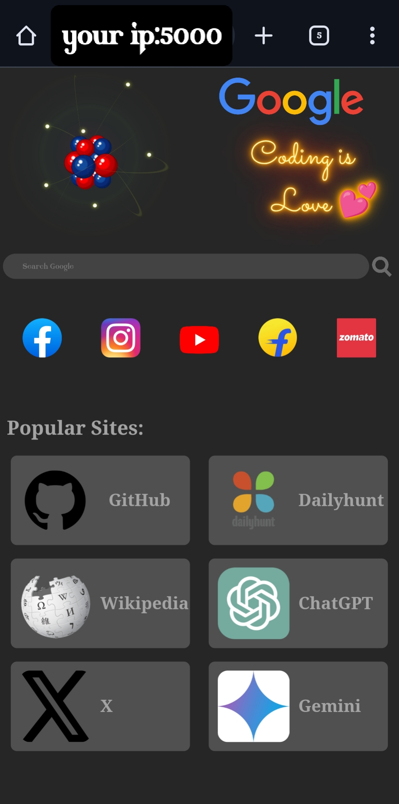

# Google-homepage-for-mobile
A cool and new customisable google homepage for mobile.

You can change it accordingly.

## Screenshot:


## How to run
To Run this, install termux in your mobile.

type:
```bash
apt update -y && apt upgrade -y
apt install python git -y
git clone https://github.com/opsonusdh/Google-homepage-for-mobile
cd Google-homepage-for-mobile
pip install flask
python app.py
```

We will work on the page to make it better and will add new features in it.

Thanks for visiting. Have a Great Day 😃


